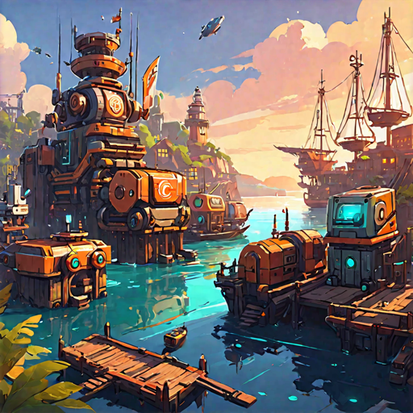

# RoboHarbor
Process Management with a user-interface. RoboHarbor helps you to launch and manage your processes in a nice and easy to use ui.

Why RoboHarbor?
RoboHarbor helps any developer to launch and control a robo in seconds. A robo is any process that you have developer that should run for ever or a specific time and needs to be monitored.

## Features

### User Interface
RoboHarbor provides a nice and easy to use user interface to manage your processes. You can start, stop, restart and kill your processes with a single click.

### Process Management
We control your robos and help you with start stop and restart. You can also see log and error entries.

### RoboHarbor API
With RoboCraft you can easily communicate with RoboHarbor
for example to send log entries or errors and get notified 
when a process is started, stopped or restarted.

## Installation
RoboHarbor is available as a docker image. 

### Usage modes

#### Standalone
You can run RoboHarbor as a standalone application. This is the default mode.

#### Managed
You can run RoboHarbor decentralized as a "Master" and 
multiple "Clients" that are managed by the master. Each 
Client can run processes and the master can control them.

